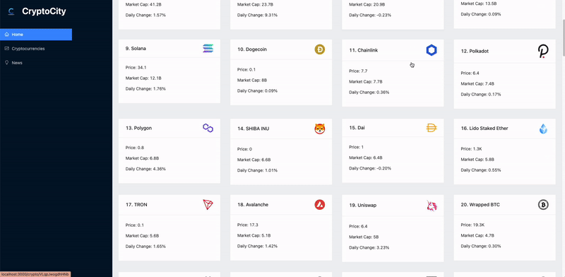
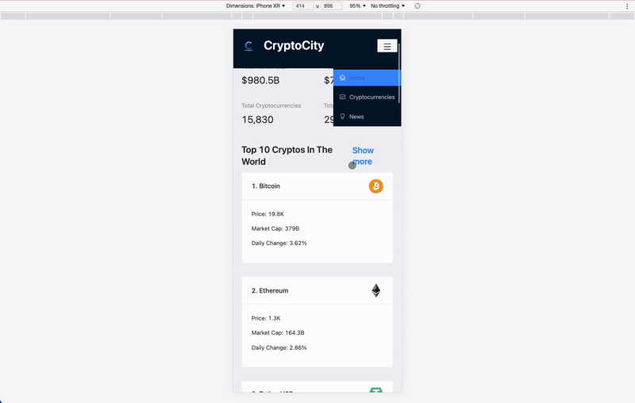

___
interactive Crypto dashboard to create data visualizations.  (Redux, ReactJS, Axios) 	 It was created using the following: 


* API's: BingNewsSearch, CoinRanking
* Frontend: React-Redux
* API Calls: Axios
* Hosting: Netlify
* Languages: Javascript, CSS, HTML

Check out the site [here](https://cryptocityapp.netlify.app/). 

## MVP Features
### 1. Homepage
Intuitive homepage where you can see all available components.  Can click into any with "Show More" to get additional information.


### 2. Api fetching
Upon clicking "Show More" on the homepage for cryptos, you are taken to the full crypto page.  The top 100 cryptos currently.  There you can filter down by typing which type of coin you want to look at.  Once selected, click the coin to look at the individual coin details, and see charts of it's value over time. 




Using Redux queries and React hooks to dynamically update functional components with state dependencies and mapping over data with react components. Also implementing custom loading react component while API is fetching to create seamless search results.

```javascript
  const CryptoDetails = () => {
  const { coinId } = useParams();
  const [timeperiod, setTimeperiod] = useState('7d');
  const { data, isFetching } = useGetCryptoDetailsQuery(coinId);
  const { data: coinHistory } = useGetCryptoHistoryQuery({ coinId, timeperiod });
  const cryptoDetails = data?.data?.coin;
//   console.log(coinHistory)

  if (isFetching) return <Loader />;

  const time = ['3h', '24h', '7d', '30d', '1y', '3m', '3y', '5y'];

  const stats = [
    { title: 'Price to USD', value: `$ ${cryptoDetails?.price && millify(cryptoDetails?.price)}`, icon: <DollarCircleOutlined /> },
    { title: 'Rank', value: cryptoDetails?.rank, icon: <NumberOutlined /> },
    { title: '24h Volume', value: `$ ${cryptoDetails?.["24hVolume"] && millify(cryptoDetails?.["24hVolume"])}`, icon: <ThunderboltOutlined /> },
    { title: 'Market Cap', value: `$ ${cryptoDetails?.marketCap && millify(cryptoDetails?.marketCap)}`, icon: <DollarCircleOutlined /> },
    { title: 'All-time-high(daily avg.)', value: `$ ${cryptoDetails?.allTimeHigh?.price && millify(cryptoDetails?.allTimeHigh?.price)}`, icon: <TrophyOutlined /> },
  ];

  const genericStats = [
    { title: 'Number Of Markets', value: cryptoDetails?.numberOfMarkets, icon: <FundOutlined /> },
    { title: 'Number Of Exchanges', value: cryptoDetails?.numberOfExchanges, icon: <MoneyCollectOutlined /> },
    { title: 'Aprroved Supply', value: cryptoDetails?.supply?.confirmed ? <CheckOutlined /> : <StopOutlined />, icon: <ExclamationCircleOutlined /> },
    { title: 'Total Supply', value: `$ ${cryptoDetails?.supply?.total && millify(cryptoDetails?.supply?.total)}`, icon: <ExclamationCircleOutlined /> },
    { title: 'Circulating Supply', value: `$ ${cryptoDetails?.supply?.circulating && millify(cryptoDetails?.supply?.circulating)}`, icon: <ExclamationCircleOutlined /> },
  ];
```

### 3. Coin filtering
If on the homepage there is a simplified version of the crypto information, only 10 coins.  On the main coin page however, it expands to 100. Used dynamic logic to show either simplified or non simplified version. 

```javascript
  const count = simplified ? 10 : 100;
  const { data: cryptosList, isFetching } = useGetCryptosQuery(count);
  const [cryptos, setCryptos] = useState();
  const [searchTerm, setSearchTerm] = useState('');

  useEffect(() => {
    setCryptos(cryptosList?.data?.coins);

    const filteredData = cryptosList?.data?.coins.filter((item) => item.name.toLowerCase().includes(searchTerm));

    setCryptos(filteredData);
  }, [cryptosList, searchTerm]);

  if (isFetching) return <Loader />;

  return (
    <>
      {!simplified && (
        <div className="search-crypto">
          <Input
            placeholder="Search Cryptocurrency"
            onChange={(e) => setSearchTerm(e.target.value.toLowerCase())}
          />
        </div>
      )}
```

### 4. News
Filter news about specific cryptos by filtering and using state.

```javascript
 <Select
            showSearch
            className="select-news"
            placeholder="Select a Crypto"
            optionFilterProp="children"
            onChange={(value) => setNewsCategory(value)}
            filterOption={(input, option) => option.children.toLowerCase().indexOf(input.toLowerCase()) >= 0}
          >
            <Option value="Cryptocurency">Cryptocurrency</Option>
            {data?.data?.coins?.map((currency) => <Option value={currency.name}>{currency.name}</Option>)}
          </Select>
```


### 5. Chart
Dynamically add chart data by category to arrays, that are then implemented into React ChartJS

```javascript
        const coinPrice = [];
  const coinTimestamp = [];

  for (let i = 0; i < coinHistory?.data?.history?.length; i += 1) {
    coinPrice.push(coinHistory?.data?.history[i].price);
  }

  for (let i = 0; i < coinHistory?.data?.history?.length; i += 1) {
    coinTimestamp.push(new Date(coinHistory?.data?.history[i].timestamp*1000).toLocaleDateString());
  }

    const data = {
        labels: coinTimestamp,
        datasets: [
            {
                label: 'Price In USD',
                data: coinPrice,
                fill: false,
                backgroundColor: '#0071bd',
                borderColor: '#0071bd',
            },
        ],
    };

    const options = {
        scales: {
            yAxes: [
                {
                    ticks: {
                        beginAtZero: true,
                    },
                },
            ],
        },
    };
```


### BONUS

Fully mobile capable with dynamic menu. 



